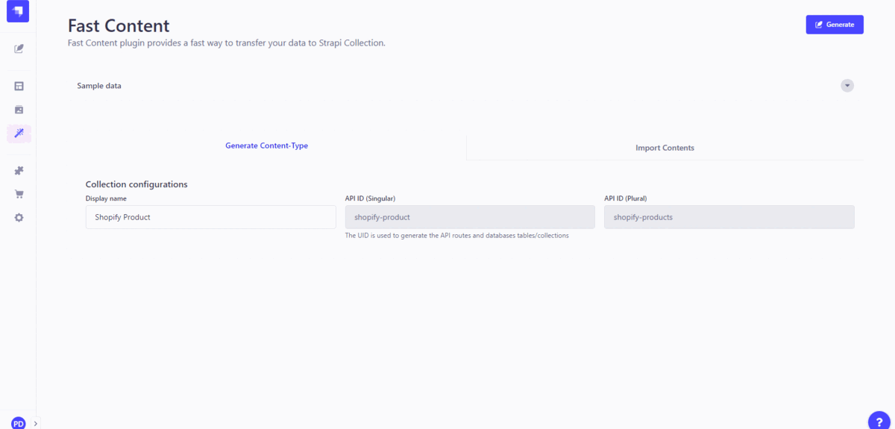

<div align="center" width="150px">
  
</div>
<div align="center">
  <h1>Strapi v4 | FAST CONTENT PLUGIN</h1>
</div>

<div style="margin: 20px 0" align="center">
  
</div>

A plugin for [Strapi Headless CMS](https://github.com/strapi/strapi) that provides a fast way to transfer your data to Strapi Collection.

---  
<!-- Start Document Outline -->

* [✨ Features](#-features)
* [📌 Requirements](#-requirements)
* [☀️ Configuration](#-configuration)
* [🚀 Installation](#-installation)
* [💫 Demo](#-demo)
* [🔑 Keywords](#-keywords)

<!-- End Document Outline -->
---
## ✨ Features
- Quickly transfer your JSON Array data to Strapi Collection.
- Instead of creating each field and data type, this plugin makes the analysis simple and usable.
- It can also be used as a backup solution for your data.

## 📌 Requirements
**Minimum environment requirements**

- Node.js `>=14.x.x`
- NPM `>=7.x.x`

In our minimum support we're following [official Node.js releases timelines](https://nodejs.org/en/about/releases/).

**Supported Strapi versions**:

- Strapi v4.4.1 (recently tested)
- Strapi v4.2.3 (recently tested)
- Strapi v4.x

## ☀️ Configuration
1. You need to enable the plugin by adding it to the plugins configurations file:

```javascript
// path: /path/to/myDevelopmentProject/config/plugins.js

module.exports = {
  // ...
  'fast-content': {
    enabled: true,
  },
  // ...
}
```

2. For Strapi to show your data correctly, you will need to edit the 'strapi::security' line in /path/to/myDevelopmentProject/config/middlewares.js
```javascript
// path: /path/to/myDevelopmentProject/config/middlewares.js

module.exports = {
  // ...
    {
    name: 'strapi::security',
    config: {
      'contentSecurityPolicy': {
        'useDefaults': true,
        'directives': {
          'connect-src': ["'self'", 'https:'],
          'script-src': ["'self'", "'unsafe-inline'", 'blob:', 'cdn.jsdelivr.net'],
          'img-src': ['*'],
          'media-src': ["'self'", 'data:', 'blob:'],
          'upgradeInsecureRequests': null,
        },
      },
    },
  },
  // ...
}
```

## 🚀 Installation
```
yarn add strapi-plugin-fast-content
yarn build
yarn develop
```
or
```
npm install strapi-plugin-fast-content
npm run build
npm run develop
```

## 💫 Demo
[https://youtu.be/hML7eNUaiZs](https://youtu.be/hML7eNUaiZs)

## 🔑 Keywords
- [strapi](https://www.npmjs.com/search?q=strapi)
- [plugin](https://www.npmjs.com/search?q=plugin)
- [fast-content](https://www.npmjs.com/search?q=strapi-plugin-fast-content)
- [fast-content-builder](https://www.npmjs.com/search?q=strapi-plugin-fast-content)
- [fcb](https://www.npmjs.com/search?q=strapi-plugin-fast-content)

---

*Good morning & I love you.*  
*Dang Nhat Phi*  
